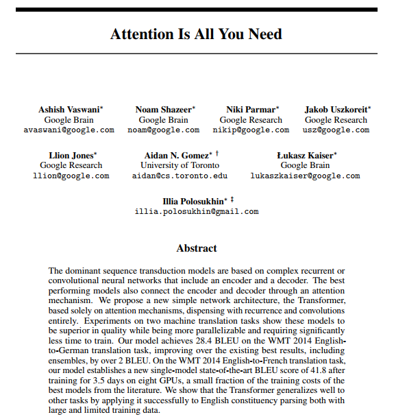
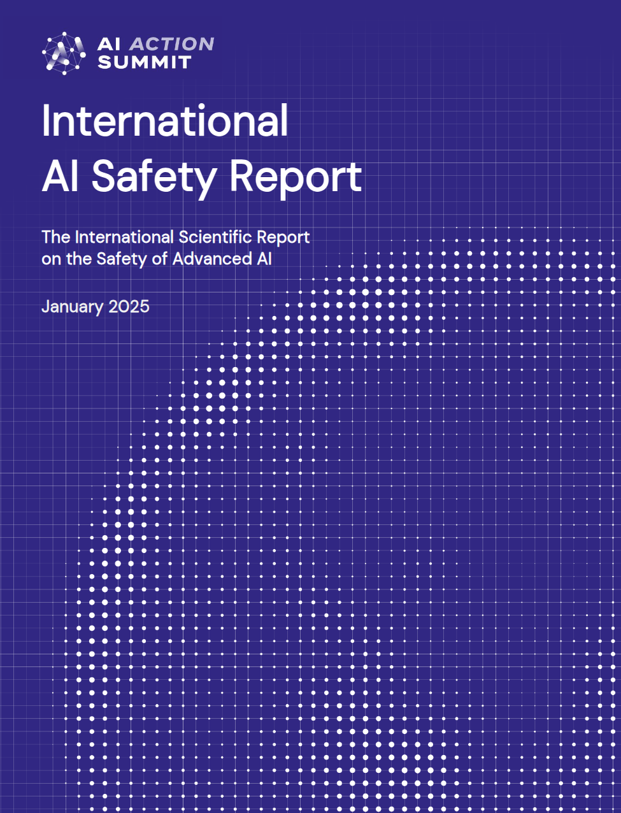
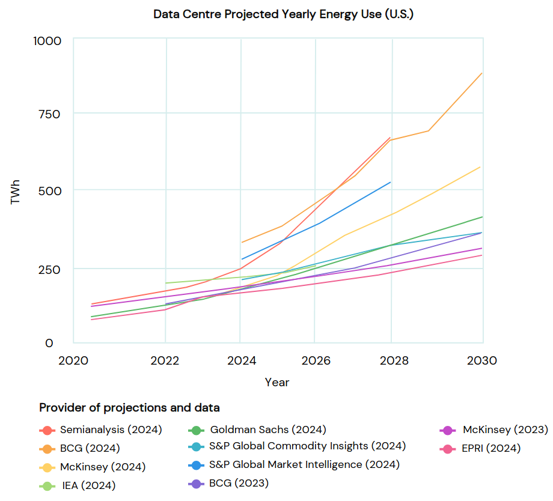
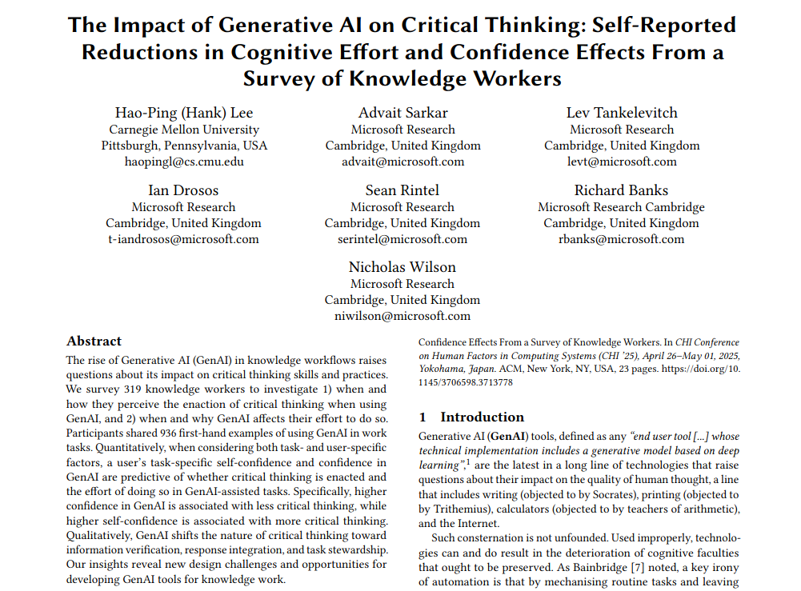

class: middle, center, title-slide

# Deep Learning

Lecture 0: Introduction

  
Prof. Gilles Louppe 
[g.louppe@uliege.be](mailto:g.louppe@uliege.be)

---

# Today

- Course outline
- Introduction to deep learning
- Fundamentals of machine learning

---

# Outline

- Lecture 1: Fundamentals of machine learning
- Lecture 2: Multi-layer perceptron
- Lecture 3: Automatic differentiation
- Lecture 4: Training neural networks
- Lecture 5: Convolutional neural networks
- Lecture 6: Computer vision
- Lecture 7: Attention and transformer networks
- Lecture 8: GPT
- Lecture 9: Graph neural networks
- Lecture 10: Uncertainty
- Lecture 11: Auto-encoders and variational auto-encoders
- Lecture 12: Score-based diffusion models

---

class: middle

.center.width-60[]

---

class: middle

## My mission

By the end of this course, you will have a strong and comprehensive understanding of deep learning. 

You will learn how to design deep neural networks for various advanced probabilistic inference tasks and how to train them.

The models covered in this course have broad applications in artificial intelligence, engineering, and science.

---

class: middle

# Why learning?

---

class: middle, center

.width-100[]

What do you see?

???

.italic[How do you do that?]

---

class: middle

.center[
.width-70[]

Sheepdog or mop?
]

.footnote[Credits: [Karen Zack](https://twitter.com/teenybiscuit), 2016.]

---

class: middle

.center[
.width-70[]

Chihuahua or muffin?
]

.footnote[Credits: [Karen Zack](https://twitter.com/teenybiscuit). 2016.]

---

class: middle

The (human) brain is so good at interpreting visual information that the gap between raw
data and its semantic interpretation is difficult to assess intuitively.

 
.center[

This is a mushroom.
]

---

class: middle, center

.width-70[]

This is a mushroom.

---

class: middle, center

.width-30[] +
.width-30[] +
.width-30[]

This is a mushroom.

---

class: middle, center

.width-80[]

This is a mushroom.

---

class: middle, center

Writing a computer program that sees?

---

class: middle

.center.width-60[]

---

count: false

.center.width-60[]

---

count: false
class: middle
background-image: url(figures/lec0/cat3.png)
background-size: cover

---

count: false
class: middle
background-image: url(figures/lec0/cat4.png)
background-size: cover

---

class: middle

To extract semantic information, we need models with high complexity .bold[that cannot be manually designed]. 

However, we can write a program that learns the task of extracting semantic information.

---

class: middle, black-slide

.center.width-70[]

The .bold[machine learning approach] consists in:
- defining a parametric model
- optimizing its parameters, by "making it work" on the training data.

---

class: middle

# The deep learning revolution

---

class: middle

Deep learning .bold[scales up] the statistical and machine learning approaches by
- using larger models known as neural networks,
- training on larger datasets,
- using more compute resources.

.grid[
.kol-3-4.width-70.center[]
.kol-1-4.width-90.center[ ]
]

???

[Talk about the slide first.]

Scaling up the statistical and machine learning approaches by brute force in these three dimensions has been key to the success of deep learning.

---

class: middle, center, black-slide

.center[
<video loop controls preload="auto" height="500" width="600">
  <source src="./figures/lec0/yann-dl.mp4" type="video/mp4">
</video>
]

---

class: middle

Specialized neural networks can be trained achieve super-human performance on many complex tasks that were previously thought to be out of reach for machines.

.width-100[]

.width-100[]

.center[(Top) Scene understanding, pose estimation, geometric reasoning. 
(Bottom) Planning, Image captioning, Question answering.]

.footnote[Credits: François Fleuret, 2023.]

???

Following this approach, deep learning has been successful in tasks that were previously considered hard for computers, such as understanding images, speech, or text.

In particular, specialized neural networks can be trained to solve a large variety of problems, from scene understanding to geometric reasoning, from planning to question answering.

While these problems can be perceived as artificial and not really important in their own right, they actually form a set of primitive tasks that are found in many domains of application. 

---

class: middle

Neural networks form .bold[primitives] that can be transferred to many domains. 

.grid[
.kol-1-3.center.width-100[]
.kol-1-3.center.width-80[]
.kol-1-3.center.width-80[]
]
.width-100[]

.center[(Top) Analysis of histological slides, denoising of MRI images, nevus detection. 
(Bottom) Whole-body hemodynamics reconstruction from PPG signals.]

???

For example, in health and medicine, the same specialized neural networks that are used to annotate scenes can be used to analyze biomedical images, such as histological slides.

Specialized neural networks can also be used to denoise MRI images, to detect nevus, or to reconstruct whole-body hemodynamics from PPG signals, if some of you have an Apple Watch.

As a matter of fact, the adoption of AI and deep learning in health and medicine has been growing steadily over the past decade, with many applications in medical imaging, genomics, and many more. 

These applications however, are often deeply embedded in the tools used by healthcare professionals, and are not always visible to the public.

---

class: middle, black-slide, center

<iframe width="600" height="450" src="https://www.youtube.com/embed/zrcxLZmOyNA" frameborder="0" allowfullscreen></iframe>

Powering the future of clean energy (NVIDIA, 2023)

---

class: middle, black-slide, center

<iframe width="600" height="450" src="https://www.youtube.com/embed/AbdVsi1VjQY" frameborder="0" allowfullscreen></iframe>

How AI is advancing medicine (Google, 2023)

---

class: middle, center, black-slide

<iframe width="600" height="450" src="https://www.youtube.com/embed/hA_-MkU0Nfw" frameborder="0" allowfullscreen></iframe>

Building autonomous cars (Waymo, 2022)

---

class: middle

## The breakthrough

.grid[
.kol-1-2.center[.width-100[  

Vaswani et al., 2017.]]
.kol-1-2[.width-100[]]
]

---

class: middle

.width-100[]

A brutal simplicity: 
- The more data, the better the model.
- The more parameters, the better the model.
- The more compute, the better the model.

Scaling up further to gigantic models, datasets, and compute resources keeps pushing the boundaries of what is possible, .bold[with no sign of slowing down].

---

class: middle, center, black-slide

<iframe width="600" height="450" src="https://www.youtube.com/embed/-dWfl7Dhb0o" frameborder="0" allowfullscreen></iframe>

Conversational AI assistants (Anthropic, 2024)

---

class: middle, center, black-slide

<iframe width="600" height="450" src="https://www.youtube.com/embed/o5uvDZ8srHA" frameborder="0" allowfullscreen></iframe>

Code assistants (Cursor, 2024)

---

class: middle, black-slide, center

<iframe width="600" height="450" src="https://www.youtube.com/embed/fWWCdqyYRPI" frameborder="0" allowfullscreen></iframe>

Not just text, but also images and sounds.

---

class: middle, center

With great power comes great responsibility.

---

class: middle

.center.width-25[]

## Risks

The report classifies risks associated with general-purpose AI into three categories:
1. Risks from .bold[malicious use] (scams, manipulation, cyberattacks, biological/chemical attacks)
2. Risks from .bold[malfunctions] (hallucinations, biases, loss of control)
3. .bold[Systemic] risks (labour market risks, global R&D divide, power concentration)

---

class: middle

.center.width-50[]

## Environmental impacts

"AI is a moderate but rapidly growing contributor to global environmental impacts through energy use and greenhouse gas (GHG) emissions. Current estimates indicate that .bold[data centres and data transmission account for an estimated 1% of global energy-related GHG emissions, with AI consuming 10–28% of data centre energy capacity]. AI energy demand is expected to grow substantially [...]"

---

class: middle

.center.width-50[]

## Dumb and dumber

"When people rely on generative AI, .bold[their effort shifts toward verifying that an AI’s response is good enough to use, instead of using higher-order critical thinking skills like creating], evaluating, and analyzing information. If humans only intervene when AI responses are insufficient then workers are deprived of routine opportunities to practice their judgment and strengthen their cognitive musculature, .bold[leaving them atrophied and unprepared] when the exceptions do arise."

---

class: middle, center

Deep learning can also .bold[solve problems that no one could solve before].

???

Beyond the basic work that can be automated, the most exciting applications of AI, at least for the scientist in me, is the fact that deep learning can also be used to solve problems that no one could solve before. To make discoveries. 

I have many examples in mind, but I will only mention a few today, to give you a sense of what is possible. I will focus on health and medicine, but the same is true in many other domains.

---

class: middle

## AlphaFold: From a sequence of amino acids to a 3D structure

.grid[
.kol-2-3.center.width-100[]
.kol-1-3.center.width-100[]
]

???

The first example is AlphaFold, a neural network based on the trasnformer architecture that can predict the 3D structure of a protein from its amino acid sequence.

This problem is important because the 3D structure of a protein determines its function, and understanding protein function is key to understanding biology and designing new drugs.

However, determining the 3D structure of a protein experimentally is difficult and expensive, taking up to months just to solve a single structure. 

AlphaFold has been a breakthrough in this area, and has been able to predict the 3D structure of proteins with high accuracy, in just a couple of minutes for the longest sequences.

---

class: middle, black-slide, center

<iframe width="600" height="450" src="https://www.youtube.com/embed/gg7WjuFs8F4" frameborder="0" allowfullscreen></iframe>

AI for Science (Deepmind, AlphaFold, 2020)

---

class: middle

## Drug discovery with graph neural networks

.center.width-80[]

???

A second example is the use of graph neural networks to discover new drugs.

Discovering new drugs is a complex and expensive search problem, where the goal is to find molecules that will bind to a target protein and modulate its function. Unfortunately, this problem is difficult for two reasons:
- first, the search space is huge -- the space all possible pharmacologically active molecules is estimated to be in the order of 10^60 molecules.
- second, the binding of a molecule to a protein is a complex process that is difficult to model. Laboratory experiments are necessary to evaluate the binding of a molecule to a protein, and these experiments are expensive and time-consuming.

Graph neural networks have been a breakthrough in this area, and have been able to predict the properties of molecules with high accuracy. 

In a sense, they can serve as a virtual laboratory that can be used to pre-screen millions of molecules in a matter of hours, thereby reducing the laboratory work to only the most promising candidates.

---

class: middle

## GraphCast: fast and accurate weather forecasts

.center.width-75[]

---

class: middle

.center.circle.width-30[]

.italic[For the last forty years we have programmed computers; for the next forty years we will train them.]

.pull-right[Chris Bishop, 2020.]

---

class: end-slide, center
count: false

The end.
